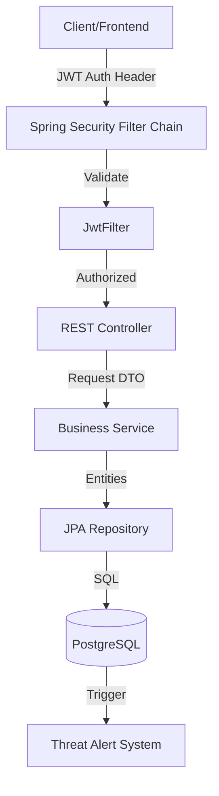

# 🛡️ Secure Access Log & Threat Analyzer (SALTA)

[](https://spring.io/projects/spring-boot)
[](https://spring.io/projects/spring-security)
[](https://www.postgresql.org/)
[](https://opensource.org/licenses/MIT)

**SALTA** is a high-performance security monitoring backend designed to protect applications from unauthorized access and brute-force attacks. It leverages **Spring Boot 3** for robust API management and **PostgreSQL Triggers** for high-efficiency, database-level threat detection.

---

## 🚀 Key Features

*   **Stateless Authentication:** Implemented with **JWT (JSON Web Tokens)** for scalable, secure session management.
*   **Brute-Force Mitigation:** Hybrid protection using PL/pgSQL triggers to automatically flag and block suspicious login patterns.
*   **Production-Ready Architecture:** Clean separation of concerns using the **Controller-Service-Repository** pattern and **DTOs**.
*   **Global Exception Handling:** Centralized error management using `@RestControllerAdvice` to ensure secure and consistent API responses.
*   **Automated Documentation:** Fully interactive API documentation powered by **Swagger UI (OpenAPI 3.0)**.
*   **Health Monitoring:** Integrated **Spring Boot Actuator** for real-time application metrics and health checks.

---

## 🏗️ System Architecture



---

## 🛠️ Tech Stack

*   **Language:** Java 17
*   **Framework:** Spring Boot 3.2.5
*   **Security:** Spring Security 6, JJWT
*   **Database:** PostgreSQL
*   **Documentation:** Springdoc-OpenAPI
*   **Build Tool:** Maven

---

## 🚦 Getting Started

### Prerequisites
*   JDK 17 or higher
*   Maven 3.6+
*   PostgreSQL 15+

### Installation & Setup

1. **Clone the repository**
   ```bash
   git clone https://github.com/harshitkmr03/securitymonitor.git
   cd securitymonitor
   ```

2. **Configure Database**
   Update `src/main/resources/application.properties` with your PostgreSQL credentials:
   ```properties
   spring.datasource.url=jdbc:postgresql://localhost:5432/security_monitoring_db
   spring.datasource.username=your_username
   spring.datasource.password=your_password
   jwt.secret=your_super_secret_key_64_chars_long
   ```

3. **Run the Application**
   ```bash
   mvn spring-boot:run
   ```

4. **Access Swagger UI**
   Navigate to: [http://localhost:8080/swagger-ui/index.html](http://localhost:8080/swagger-ui/index.html)

---

## 🔒 Security Flow

1.  **Registration:** User signs up; password is encrypted using **BCrypt**.
2.  **Authentication:** User logs in; system generates a stateless JWT token.
3.  **Authorization:** Every request is intercepted by `JwtFilter` to verify the token signature and expiration.
4.  **Threat Detection:** After 5 failed login attempts, the database trigger automatically locks the account and creates a `ThreatAlert`.

---

## 📁 Project Structure

```text
src/main/java/com/harshit/securitymonitor
├── config         # Security & OpenAPI Configurations
├── controller     # REST Endpoints
├── dto            # Data Transfer Objects (Request/Response)
├── entity         # JPA Database Entities
├── exception      # Global Error Handling
├── jwt            # Token Logic & Filters
├── repository     # Data Access Layer
└── service        # Business Logic Layer
```

---

## 📄 License

This project is licensed under the MIT License - see the [LICENSE](LICENSE) file for details.

---
*Developed by [Harshit Kumar](https://github.com/harshitkmr03)*
